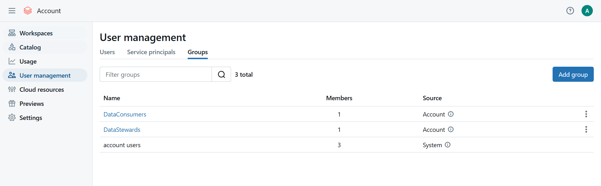

# Data Governance

- All the below steps can ideally be done by a metastore admin.
- Create a group in the Admin console → `DataConsumers`
    
    
    
- Add users -
    
    
    
- Add members/users in the Group -
    
    
    
- Give this group `User` level permission to the workspace - You can only give admin level or user level. Any one/group who should not be an admin should be given `User` permission to the workspace. So that means that group and all the members of that group now has `User` access on the workspace.
    
    
    
- Now the users under group `DataConsumer` can log into this workspace but they wont have admin access.
- Give `DataConsumer` the below accesses -
    
    ```sql
    GRANT SELECT ON TABLE processing_catalog.schema_harmonized_facts.t_sales_line_items_test TO `DataConsumers`;
    GRANT USAGE ON SCHEMA processing_catalog.schema_harmonized_facts TO `DataConsumers`;
    ```
    
- Verify the same -
    
    
    
- I want to revoke these accesses and only give them very fine tuned access
    
    
    
    
    
- Verify the same -
    
    
    
- I have created views in curated layer for Data Analysis. So I want to give the `DataConsumer` access to those views.
- Grant select access on those views -
    
    
    
- The above access is not enough they should be given USAGE access on the schema to query these views. DO NOT give MANAGE access unless necessary
    
    
    
- Login to the workspace as a member of `DataConsumer` and you’ll see the necessary access
    
    
    
    
    
    
    
- No access to any other schema -
    
    